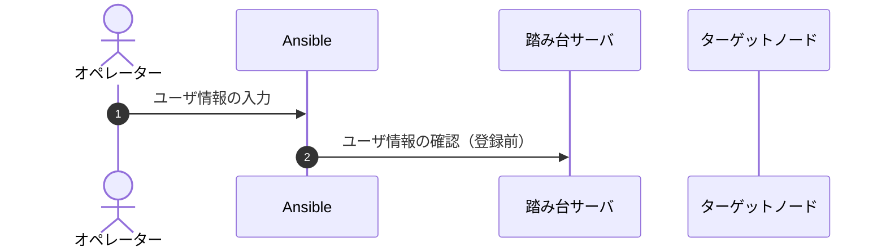
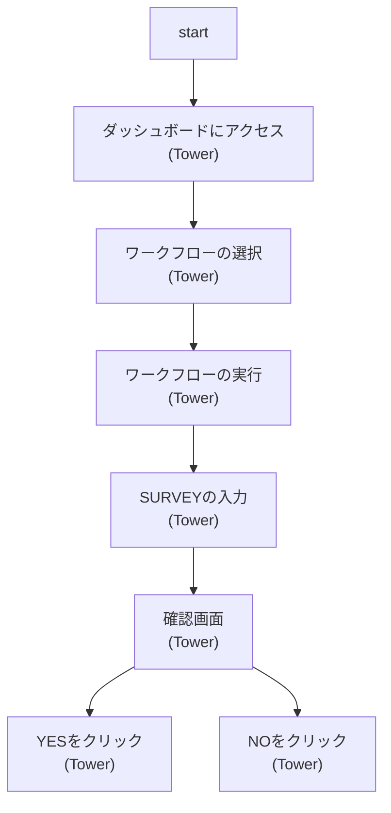

# おためしシーケンス図

## サマリ

```mermaid
sequenceDiagram
  autonumber
  actor A as オペレーター
  participant B as Ansible
  participant C as 踏み台サーバ
  participant D as ターゲットノード

  A->>B: ユーザ情報の入力
  B->>C: ユーザ情報の確認（登録前）
```

## ユーザ情報の入力

```mermaid
flowchart TD
  Aa["start"]
  Ba["ダッシュボードにアクセス<br>(Tower)"]
  Ca["ワークフローの選択<br>(Tower)"]
  Da["ワークフローの実行<br>(Tower)"]
  Ea["SURVEYの入力<br>(Tower)"]
  Fa["確認画面<br>(Tower)"]
  Fb["YESをクリック<br>(Tower)"]
  Fc["NOをクリック<br>(Tower)"]

  Aa-->Ba-->Ca-->Da-->Ea-->Fa
  Fa-->Fb
  Fa-->Fc
```
