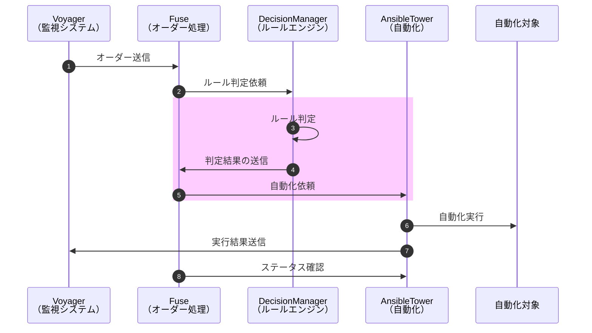

```mermaid
sequenceDiagram
  autonumber
  participant A as Voyager<br>（監視システム）
  participant B as Fuse<br>（オーダー処理）
  participant C as DecisionManager<br>（ルールエンジン）
  participant D as AnsibleTower<br>（自動化）
  participant E as 自動化対象

  A->>B: オーダー送信
  B->>C: ルール判定依頼
  rect rgba(255,0,255, 0.2)
  C->>C: ルール判定
  C->>B: 判定結果の送信
  B->>D: 自動化依頼
  end
  D->>E: 自動化実行  
  D->>A: 実行結果送信
  B->>D: ステータス確認 
```
