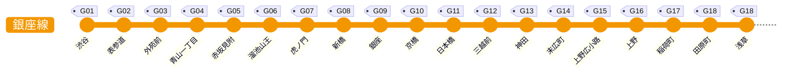
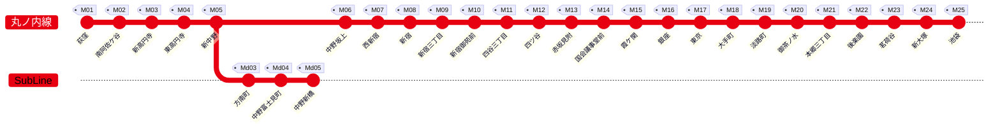
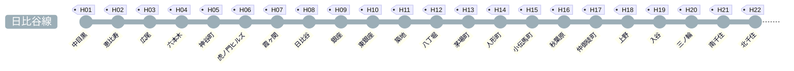

## 東京メトロ（銀座線）

```mermaid
%%{ init: { 'themeVariables': { 'git0': '#f39700' },'gitGraph':{'mainBranchName': '銀座線'} } }%%
gitGraph
    commit id: "渋谷" tag: "G01"
    commit id: "表参道" tag: "G02"
    commit id: "外苑前" tag: "G03"
    commit id: "青山一丁目" tag: "G04"
    commit id: "赤坂見附" tag: "G05"
    commit id: "溜池山王" tag: "G06"
    commit id: "虎ノ門" tag: "G07"
    commit id: "新橋" tag: "G08"
    commit id: "銀座" tag: "G09"
    commit id: "京橋" tag: "G10"
    commit id: "日本橋" tag: "G11"
    commit id: "三越前" tag: "G12"
    commit id: "神田" tag: "G13"
    commit id: "末広町" tag: "G14"
    commit id: "上野広小路" tag: "G15"
    commit id: "上野" tag: "G16"
    commit id: "稲荷町" tag: "G17"
    commit id: "田原町" tag: "G18"
    commit id: "浅草" tag: "G18"
```

## 東京メトロ（丸ノ内線）

```mermaid
%%{init: {'themeVariables': { 'git0': '#e60012', 'git1': '#e60012' }, 'gitGraph':{'mainBranchName': '丸ノ内線'}} }%%
gitGraph
    commit id: "荻窪" tag: "M01"
    commit id: "南阿佐ケ谷" tag: "M02"
    commit id: "新高円寺" tag: "M03"
    commit id: "東高円寺" tag: "M04"
    commit id: "新中野" tag: "M05"
    branch SubLine
        commit id: "方南町" tag: "Md03"
        commit id: "中野富士見町" tag: "Md04"
        commit id: "中野新橋" tag: "Md05"
    checkout "丸ノ内線"
    commit id: "中野坂上" tag: "M06"
    commit id: "西新宿" tag: "M07"
    commit id: "新宿" tag: "M08"
    commit id: "新宿三丁目" tag: "M09"
    commit id: "新宿御苑前" tag: "M10"
    commit id: "四谷三丁目" tag: "M11"
    commit id: "四ツ谷" tag: "M12"
    commit id: "赤坂見附" tag: "M13"
    commit id: "国会議事堂前" tag: "M14"
    commit id: "霞ケ関" tag: "M15"
    commit id: "銀座" tag: "M16"
    commit id: "東京" tag: "M17"
    commit id: "大手町" tag: "M18"
    commit id: "淡路町" tag: "M19"
    commit id: "御茶ノ水" tag: "M20"
    commit id: "本郷三丁目" tag: "M21"
    commit id: "後楽園" tag: "M22"
    commit id: "茗荷谷" tag: "M23"
    commit id: "新大塚" tag: "M24"
    commit id: "池袋" tag: "M25"
```

## 東京メトロ（日比谷線）

```mermaid
%%{ init: { 'themeVariables': { 'git0': '#9caeb7' },'gitGraph':{'mainBranchName': '日比谷線'} } }%%
gitGraph
    commit id: "中目黒" tag: "H01"
    commit id: "恵比寿" tag: "H02"
    commit id: "広尾" tag: "H03"
    commit id: "六本木" tag: "H04"
    commit id: "神谷町" tag: "H05"
    commit id: "虎ノ門ヒルズ" tag: "H06"
    commit id: "霞ヶ関" tag: "H07"
    commit id: "日比谷" tag: "H08"
    commit id: "銀座" tag: "H09"
    commit id: "東銀座" tag: "H10"
    commit id: "築地" tag: "H11"
    commit id: "八丁堀" tag: "H12"
    commit id: "茅場町" tag: "H13"
    commit id: "人形町" tag: "H14"
    commit id: "小伝馬町" tag: "H15"
    commit id: "秋葉原" tag: "H16"
    commit id: "仲御徒町" tag: "H17"
    commit id: "上野" tag: "H18"
    commit id: "入谷" tag: "H19"
    commit id: "三ノ輪" tag: "H20"
    commit id: "南千住" tag: "H21"
    commit id: "北千住" tag: "H22"
```

