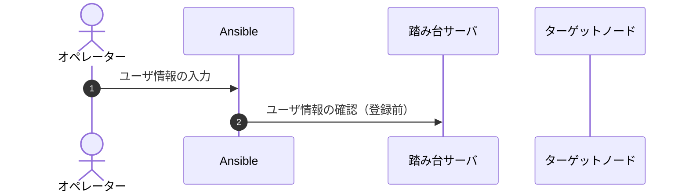

# おためしシーケンス図

## part0:workflow
システムへのユーザ登録の自動化

```mermaid
sequenceDiagram
  autonumber
  actor A as オペレーター
  participant B as Ansible
  participant C as 踏み台サーバ
  participant D as ターゲットノード

  A->>B: ユーザ情報の入力
  B->>C: ユーザ情報の確認（登録前）
　


```
