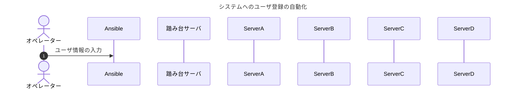

# おためしシーケンス図

## part0:workflow

```mermaid
sequenceDiagram
  autonumber
  Title: システムへのユーザ登録の自動化
  actor A as オペレーター
  participant B as Ansible
  participant C as 踏み台サーバ
  participant D as ServerA
  participant E as ServerB
  participant F as ServerC
  participant G as ServerD

  A->>B: ユーザ情報の入力
```
