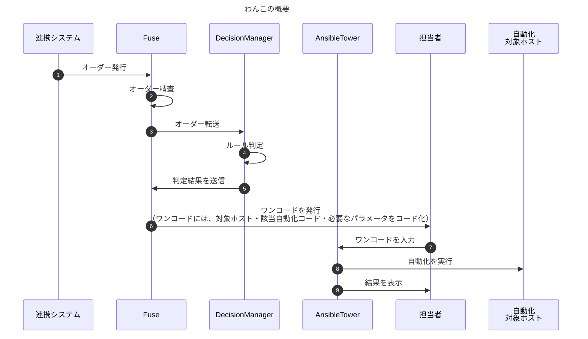

## フロー（概要）

```mermaid
sequenceDiagram
  autonumber
  Title: わんこの概要
  participant A as 連携システム
  participant B as Fuse
  participant C as DecisionManager
  participant D as AnsibleTower
  participant E as 担当者
  participant F as 自動化<br>対象ホスト

  A->>B: オーダー発行
  B->>B: オーダー精査
  B->>C: オーダー転送
  C->>C: ルール判定
  C->>B: 判定結果を送信
  B->>E: <br>ワンコードを発行<br>（ワンコードには、対象ホスト・該当自動化コード・必要なパラメータをコード化）
  E->>D: ワンコードを入力
  D->>F: 自動化を実行
  D->>E: 結果を表示　
```

[google](https://google.com)

## 例１：システム監視

```mermaid
sequenceDiagram
  autonumber
  Title: わんこの概要
  participant A as 連携システム
  participant B as Fuse
  participant C as DecisionManager
  participant D as AnsibleTower
  participant E as 担当者
  participant F as 自動化<br>対象ホスト

  A->>B: オーダー発行
  B->>B: オーダー精査
  B->>C: オーダー転送
  C->>C: ルール判定
  C->>B: 判定結果を送信
  B->>E: <br>ワンコードを発行<br>（ワンコードには、対象ホスト・該当自動化コード・必要なパラメータをコード化）
  E->>D: ワンコードを入力
  D->>F: 自動化を実行
  D->>E: 結果を表示
```
